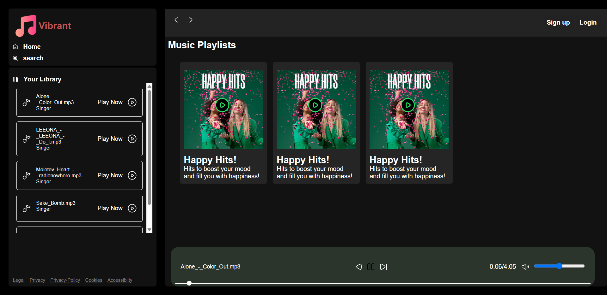

# 🎧 Spotify Clone - Vibrant Media Player

**Vibrant Media Player** is a front-end-only Spotify-inspired music player web application. Built with **HTML5**, **CSS3**, and **vanilla JavaScript**, it recreates a sleek and responsive interface for browsing playlists, selecting songs, and enjoying a smooth media experience.

---

## 📸 Preview

---

## 🌟 Features

- 🎼 Music Playlist UI inspired by Spotify
- 🎵 Dynamic song loading using JavaScript and Fetch API
- ▶️ Media controls: Play, Pause, Next, Previous
- 🔊 Volume slider with mute/unmute toggle
- 🎚️ Interactive seek bar and real-time audio progress
- 📱 Fully responsive design with sidebar toggles for mobile
- 🔐 Styled Login and Signup pages (UI only, no backend)

---

## 🛠 Technologies Used

- **HTML5** for semantic structure
- **CSS3** for styling and responsive layout
  - Custom styles split across `Style.css`, `StyleForm.css`, `Utility.css`
- **JavaScript (ES6+)** for interactive behavior and audio playback
- **SVGs** for crisp, scalable UI icons

---

## 📁 Folder Structure

---

## 🖥 How to Run

1. Clone or download this repository.
2. Open `Home.html` in any modern browser.
3. Make sure to use **Live Server** (VSCode extension or local server) for fetch requests to work.
4. Click any playlist card to dynamically load songs and start listening!

---

## 🔮 Future Improvements

- Backend integration for login and signup
- Persistent playlists and liked songs storage
- Song upload functionality
- Real-time music APIs (Spotify SDK, SoundCloud, etc.)

---

## 👨‍💻 Developer

**Gaurav Sharma**  
*Full Stack Developer | Lambton College*

---

## 📝 License

This project is for educational and personal learning use only.

---

